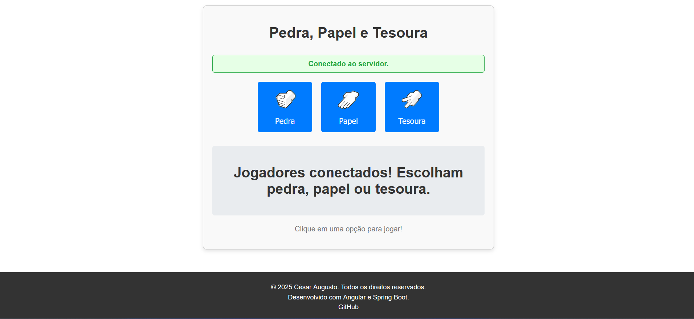

# Pedra, Papel e Tesoura Online

Um jogo multiplayer de Pedra, Papel e Tesoura em tempo real. Você joga contra outro jogador conectado ao mesmo tempo.

<<<<<<< HEAD
## O que o projeto faz

- Conecta dois jogadores através de WebSocket
- Permite que você faça sua escolha (pedra, papel ou tesoura)
- Mostra o resultado da partida em tempo real
- Mantém você informado sobre o status da conexão

## Problemas que resolve

- Permite jogar Pedra, Papel e Tesoura com outra pessoa remotamente
- Elimina a necessidade de estar no mesmo local físico
- Fornece resultado instantâneo sem manipulação
- Não precisa de cadastro ou login

## Tecnologias

**Frontend:**
- Angular 19
- TypeScript
- WebSocket API
- CSS3

**Backend (não incluído neste repositório):**
- Spring Boot
- WebSocket
- Java

## Requisitos

Você precisa ter instalado:

- Node.js 18 ou superior
- npm 9 ou superior
- Angular CLI 19

Para o backend funcionar:
- Java 17 ou superior
- Maven 3.6 ou superior
- Backend rodando em `http://localhost:8080`

## Instalação

### 1. Clone o repositório

```bash
git clone https://github.com/CesarAVB/rock-paper-scissors-frontend.git
cd rock-paper-scissors-frontend
```

### 2. Instale as dependências

```bash
npm install
```

### 3. Configure o backend

O frontend espera que o backend esteja rodando em:
```
ws://localhost:8080/game
```

Se seu backend usar outra porta, edite o arquivo `src/app/websocket.ts`:

```typescript
private readonly WS_URL = 'ws://localhost:SUA_PORTA/game';
```

### 4. Execute a aplicação

```bash
ng serve
```

### 5. Acesse no navegador

Abra seu navegador em:
```
http://localhost:4200
```

## Como usar

1. Abra a aplicação em duas abas ou navegadores diferentes
2. Aguarde a mensagem "Conectado ao servidor"
3. Quando aparecer "Clique em uma opção para jogar", escolha pedra, papel ou tesoura
4. Aguarde o outro jogador fazer sua escolha
5. Veja o resultado da partida
6. Jogue novamente clicando em outra opção

## Estrutura do projeto

```
src/
├── app/
│   ├── game/           # Componente principal do jogo
│   ├── footer/         # Rodapé da página
│   ├── websocket.ts    # Serviço de conexão WebSocket
│   └── app.ts          # Componente raiz
├── assets/             # Imagens (pedra, papel, tesoura)
└── styles.css          # Estilos globais
```

=======


## O que o projeto faz

- Conecta dois jogadores através de WebSocket
- Permite que você faça sua escolha (pedra, papel ou tesoura)
- Mostra o resultado da partida em tempo real
- Mantém você informado sobre o status da conexão

**Backend (não incluído neste repositório):**
- Spring Boot
- WebSocket
- Java

## Como usar

1. Abra a aplicação em duas abas ou navegadores diferentes
2. Aguarde a mensagem "Conectado ao servidor"
3. Quando aparecer "Clique em uma opção para jogar", escolha pedra, papel ou tesoura
4. Aguarde o outro jogador fazer sua escolha
5. Veja o resultado da partida
6. Jogue novamente clicando em outra opção

>>>>>>> 5a846c7a9a8633a53204140d9c04eb7b625d2a9d
## Funcionalidades

- Conexão em tempo real via WebSocket
- Indicador visual de status de conexão
- Desabilita botões enquanto aguarda oponente
- Mostra resultado formatado da partida
- Design responsivo e clean
- Feedback visual para todas as ações

<<<<<<< HEAD
## Como contribuir

1. Faça um fork do projeto
2. Crie uma branch para sua feature:
```bash
git checkout -b minha-feature
```

3. Commit suas mudanças:
```bash
git commit -m "Adiciona minha feature"
```

4. Faça push para a branch:
```bash
git push origin minha-feature
```

5. Abra um Pull Request

## Reportar problemas

Encontrou um bug? Abra uma issue descrevendo:
- O que você esperava que acontecesse
- O que realmente aconteceu
- Passos para reproduzir o problema
- Prints ou mensagens de erro (se houver)

=======
>>>>>>> 5a846c7a9a8633a53204140d9c04eb7b625d2a9d
## Melhorias futuras

- Adicionar placar de vitórias
- Modo treino contra IA
- Sala de espera com lista de jogadores
- Chat entre jogadores
- Histórico de partidas

<<<<<<< HEAD
## Licença

Este projeto usa a licença MIT. Você pode usar, modificar e distribuir livremente.

## Contato

Desenvolvido por César Augusto

- GitHub: [@CesarAVB](https://github.com/CesarAVB)

=======
>>>>>>> 5a846c7a9a8633a53204140d9c04eb7b625d2a9d
## Notas importantes

- O jogo precisa de exatamente 2 jogadores conectados para funcionar
- Se um jogador desconectar, o outro será notificado
- A conexão WebSocket reconecta automaticamente em caso de falha
<<<<<<< HEAD
- Os botões ficam desabilitados quando não há conexão ativa
=======
- Os botões ficam desabilitados quando não há conexão ativa
>>>>>>> 5a846c7a9a8633a53204140d9c04eb7b625d2a9d
